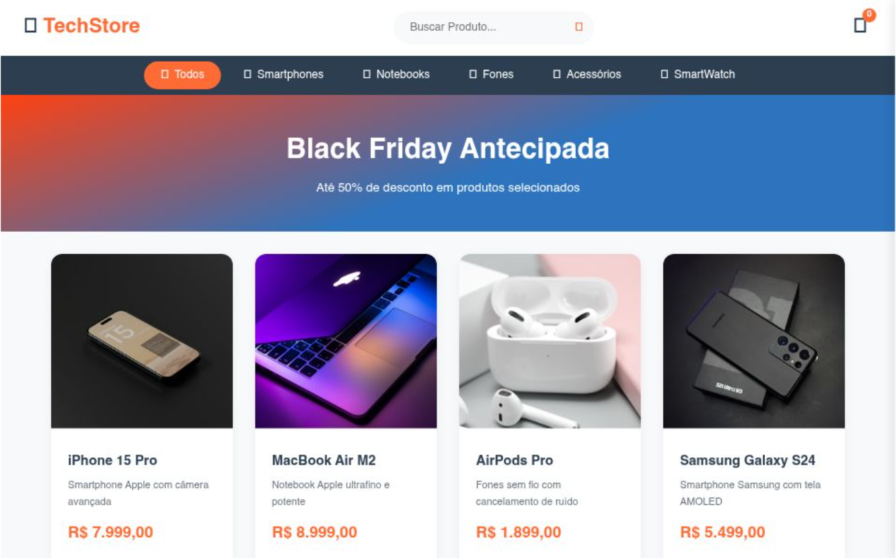

# 💻 Tech Store - E-commerce de Tecnologia

> Uma interface moderna e responsiva voltada para o varejo de eletrônicos, focada em clareza visual e experiência de compra otimizada.

## 🔗 Demonstração
**Veja o projeto online:** [Acesse aqui](https://tech-store-six-rho.vercel.app/)

---

## 💻 Sobre o Projeto
O projeto **Tech Store** foi desenvolvido para simular uma loja virtual de dispositivos tecnológicos. O foco principal foi a organização de um catálogo de produtos variados, utilizando **CSS Grid** e **Flexbox** para manter o alinhamento perfeito, independentemente do tamanho da tela. Procurei seguir uma estética "clean" e tecnológica, facilitando a leitura das especificações dos produtos.

## 🛠️ Tecnologias Utilizadas
- **HTML5:** Estrutura semântica para acessibilidade e SEO.
- **CSS3:** Estilização moderna com variáveis e efeitos de hover.
- **JavaScript:** Lógica para interatividade e dinamismo na página.
- **Vercel:** Deploy automatizado e hospedagem.

## 🎨 Diferenciais Técnicos
- **Grid de Produtos:** Layout organizado que permite uma visualização rápida e eficiente dos itens.
- **Design Responsivo:** Navegação fluida adaptada para smartphones, tablets e desktops.
- **Interface Intuitiva:** Foco na experiência do usuário (UX) para facilitar o fluxo de navegação.

## 📸 Preview

---
### 👨‍💻 Contato
**Matheus Rodrigues** [LinkedIn](https://www.linkedin.com/in/matheus-rodrigues-4398423b9) | [GitHub](https://github.com/mathrodriguesdev-arch)
